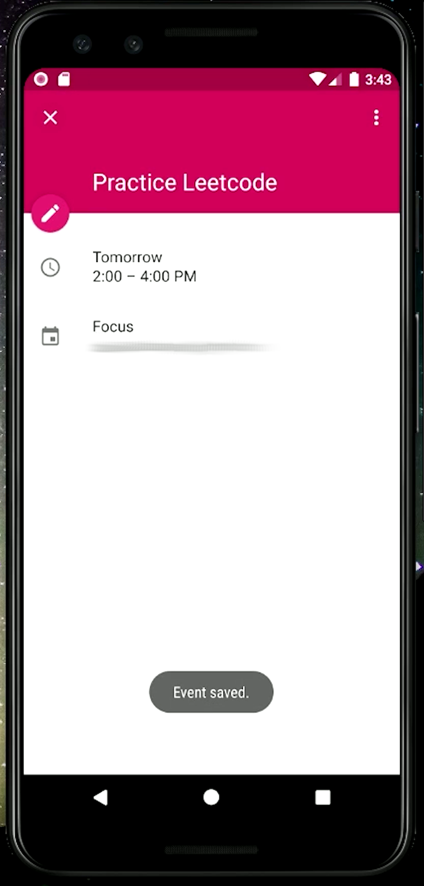
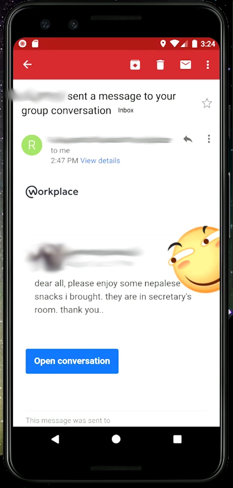
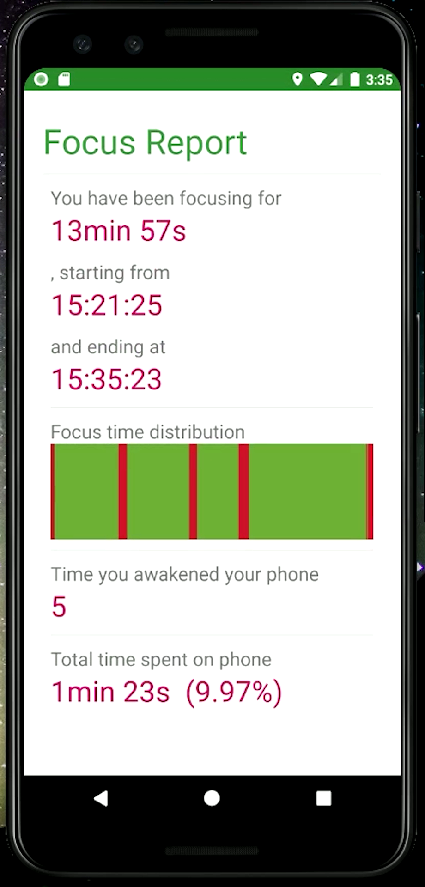

<h1>Focus</h1>

# Introduction

A simple Android application featuring a work-time supervisor.
Get rid of your phone while working!

<table>
<tr>
<th>Set up</th>
<th>Get supervised</th>
<th>View report</th>
</tr>
<tr>
<td></td>
<td></td>
<td></td>
</tr>
</table>

Guess what would happen if you do?

# Requirements

- Java 1.8
- Kotlin 1.3
- Gradle 3.4
- Android SDK 26

# Usage

## Register This Application

My application credential hasn't been approved by Google, so by far you have to register your own application on [Google Cloud console flow for the Google Calendar API](https://cloud.google.com/console/start/api?id=calendar).

- If necessary, sign in to your Google Account, select or create a project, and agree to the terms of service. Click Continue.
- For Platform select "Android".
  - For "Package name" you should make up a unique name that has never been used before by anyone, e.g. using your name and date like "com.linkinpark213.focus.harper1125".
    - Note: Make sure to pick a legal Java package name since we will be using it in the Android project source code. The full package name must have at least two parts, so for example "linkinpark213" will not work.
    - Note: If you try to register a package name that has already been registered, you may get an error reading "An unexpected error has occurred." In particular, "com.linkinpark213.focus" has already been registered, so you must change the package name.
  - For "SHA1 fingerprint", use the value that is output when running this command in a Terminal:
    - keytool -exportcert -alias androiddebugkey -keystore ~/.android/debug.keystore | openssl sha1
  - When asked, use "android" (without the quotes) as the keystore password.
  - Click Register.
- Click on "APIs" under "APIs & auth" in the left sidebar and make sure "Calendar API" is enabled.

## Configure This Project

- Import this project in your Android Studio.
  - Select "Import Project..." or File > Import Project...
  - Select \[someDirectory\]/focus/build.gradle and click OK.
  - Select "Use local gradle distribution" with "Gradle home" of \[someDirectory\]/gradle-3.4.2 and click OK.
- Open AndroidManifest.xml and change the package attribute of the manifest, initially "com.linkinpark213.focus", to match the name you registered in the Google Cloud Console, e.g. "com.linkinpark213.focus.harper1125".
- Rename the Java package: right-click on app/src/main/java, click New, click Package, and then enter the name you registered in the Google Cloud Console, e.g. "com.linkinpark213.focus.harper1125". Next, select the Java classes in the package "com.linkinpark213.focus", drag them into the new package you just created, and then click Refactor.

## Run

- In Android Studio, click Run > Run 'focus'.
